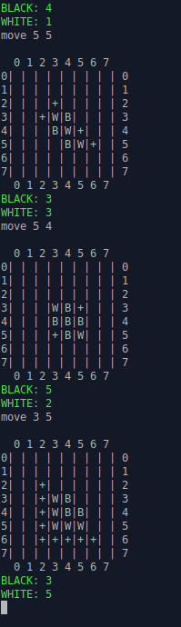
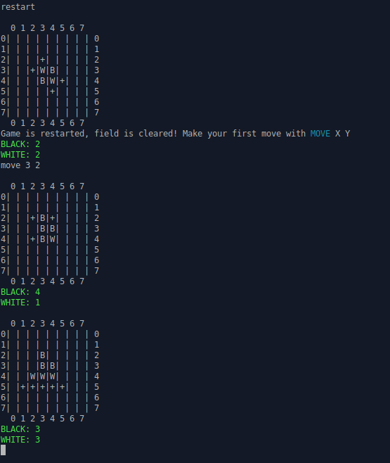

# Othello
Creating game Reversi in console by C# & using MVC architecture pattern

#### First lab of Game Development course created by Artem Korotenko(*Github: artem-korotenko*)

### Screenshots

Launching program                                                         

"Start" - game is started in mode for 2 players                                                    

Two players are playing. According to Othello rules first move was made by BLACKS.                                                   
"Move X Y" - by typing this command player make move in corresponding cell.                                                                   
"+" means available moves for current player.                                                                                                              

If player type wrong cell coordinates, he will receive an error message until he input correct value

If u want to play against computer, u should input "exit" and then "start computer" ang game will start.
As u can see below, move command was inputed only once, but field was drawn two times, because computer made a move instantly.     

If u want to restart game without changing mode - simply type "restart"                                                     

